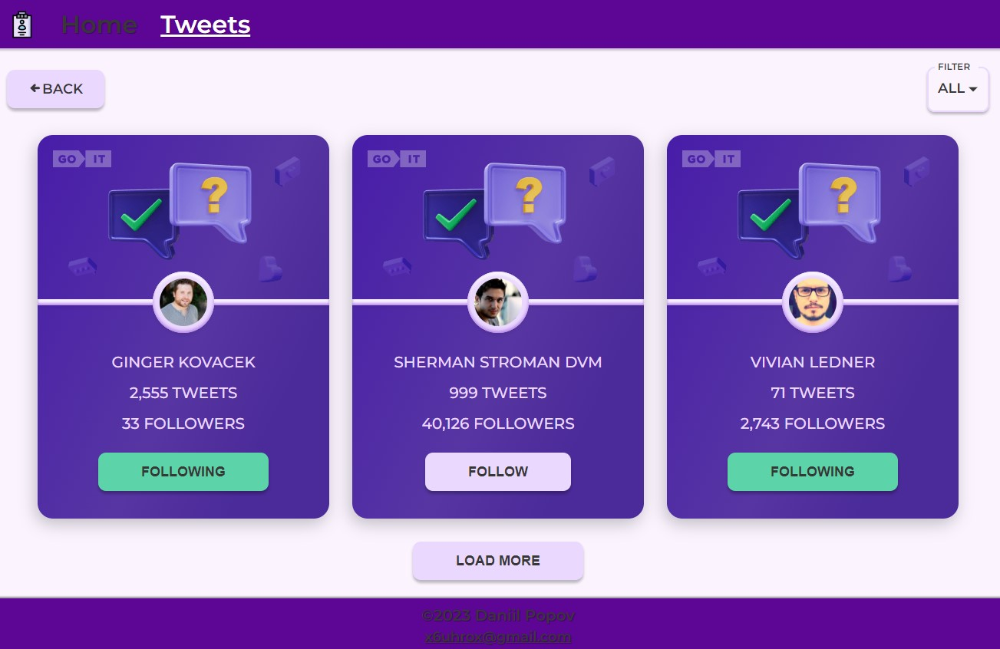

# **TweetCards**
Simple app for viewing user cards with tweets.
## **View aplication**



## Technology stack

- React
- Redax-Toolkit
- Mockapi.ioпользователя
- Axios
- MUI
- Emotion

## Realized:

- `Home` page with a short description about the app
- `Tweets` page with cards with information about the user, the number of subscribers, the number of posts with the ability to subscribe
- `DropDown` with filter cards by status
- `LoadMore` button for load the tweet cards
- `Back` button for back to the previous page
- Status card saves to `localstorage` and send to `backend`
- Informing the user about the 'follow' status change

## Technical task

1. According to the
   [layout](https://www.figma.com/file/zun1oP6NmS2Lmgbcj6e1IG/Test?node-id=0-1&t=uUlaHyxCuOAc20AW-0)
   you need to implement user cards.
2. When you click on the `Follow` button, the text changes to `Following`. The color of the button
   also changes. And yours is added to the number of followers. That is, the initial number is
   100,500 followers. When you click on the button, it will be 100,501.
3. When the page is updated, the final result of the user's actions should be recorded. That is, if
   you click on button and refresh the page - the button still remains in `Following` state with the
   corresponding color, and the number of followers does NOT decrease to the initial value.
4. When you click the button again, its text and color change to their original state. Also the
   number of followers also changes. It decreases by 1 (100,500).
5. In the code, the number 100,500 must be written with one value (100500). In the UI - displayed
   with a comma (100,500).
6. Create your personal backend for development using the UI service `mockapi.io`. Create a resource
   `users`.
7. Use the resource constructor and describe the user object as described above.

### User

1. Create a local database (a separate `json` file) with the following fields:

   - `id`,
   - `user`,
   - `tweets`,
   - `followers`,
   - `avatar`

<sub><i>(see the code is below).</i></sub>

2. Avatar images must be specified with separate urls in the `avatar` property. You can pick them up
   independently
3. There should be at least 30 users with different data (at your discretion) in the database. Make
   pagination. On one the pagination page should display from 8 to 12 tweets, the rest should be
   loaded when clicked `Load More`
4. According to the database, you need to generate the appropriate number of cards on the front-end
   of the application.
5. Each card must be functionally independent from each other.
6. The rest of the requirements are similar to the technical task described above.

```json
[
  {
    "id": 1,
    "user": "Elon Reeve Musk",
    "tweets": 777,
    "followers": 100500,
    "avatar": "url.jpg"
  }
]
```

## Additional task

> You will be awarded additional points for performance! Without completing an additional task, you
> will not be able to get the maximum score.

- Create routing using `React Router`.
- The application must have the following routes. If the user entered by a non-existent route, his
  must be redirected to the home page.
- `'/'` – component `Home`, home page. (Styling and design at your discretion);
- `'/tweets’` - component `tweets`, page displaying tweets The `tweets` page must have `Back`
  button, which leads to the main page.

## Tasks with an asterisk

Add filtering. It should be a `Dropdown` with 3 options (the layout is up to you): `show all`,
`follow`, `followings`

- `show all` - show all tweets.
- `follow` - show tweets that have status `follow`.
- `followings` - show tweets that have status `following`
